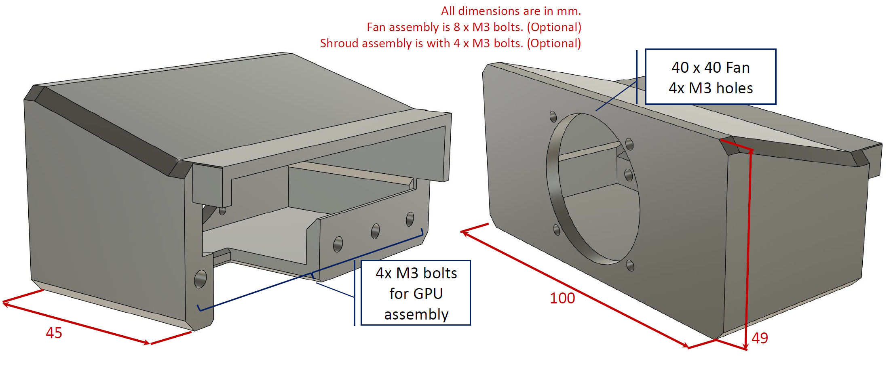
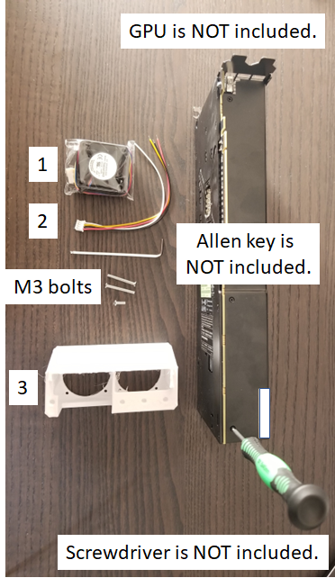
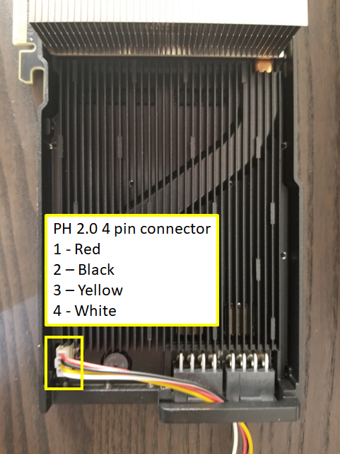
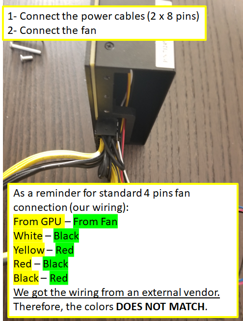
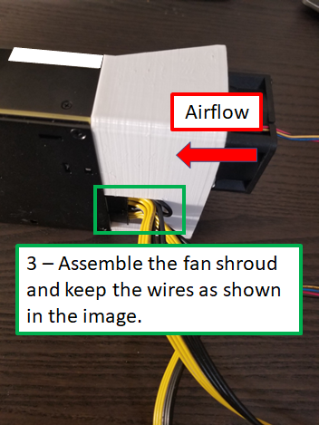
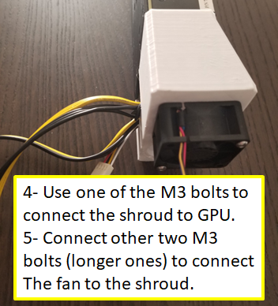

"The Radeon Instinct MI25 is a professional graphics card by AMD, launched on June 27th, 2017. Built on the 14 nm process, and based on the Vega 10 graphics processor, in its Vega 10 XT GL variant, the card supports DirectX 12. The Vega 10 graphics processor is a large chip with a die area of 495 mm² and 12,500 million transistors. It features 4096 shading units, 256 texture mapping units, and 64 ROPs. AMD has paired 16 GB HBM2 memory with the Radeon Instinct MI25, which are connected using a 2048-bit memory interface. The GPU is operating at a frequency of 1400 MHz, which can be boosted up to 1500 MHz, memory is running at 852 MHz.
Being a dual-slot card, the AMD Radeon Instinct MI25 draws power from 2x 8-pin power connectors, with power draw rated at 300 W maximum. This device has no display connectivity, as it is not designed to have monitors connected to it. Radeon Instinct MI25 is connected to the rest of the system using a PCI-Express 3.0 x16 interface. The card measures 267 mm in length, 111 mm in width, and features a dual-slot cooling solution." [Reference](https://www.techpowerup.com/gpu-specs/radeon-instinct-mi25.c2983)

MI25 is a GPU with passive cooler. This GPU in general utilized servers which have cooling system inside the chassis. One can see an example from [Lenovo](https://pubs.lenovo.com/sr670/install_a_GPU_AMD.html). The design process of the cooling of the GPUs is pretty straightfoward. We first compute the necessary air flow and came up with some fan sizing and selection. Then, we design a fan shroud that will house the fan and allow a connection between GPU and fan. You can see the single fan design below.

We printed this design by using PLA and PETG materials that we have and assembled by following the steps indicated in the pictures below:  
**1** - Fan (THA0412AD),  
**2** - PinHeader 2.0 mm 4 pin connector to standard 4 pin PWM connector,  
**3** - Fan shroud for dual 40x40 sized fan,  
The kit includes with one short M3 bolts and two long M3 bolts (no allen key or screwdriver).  

You can find all of these available at Ebay store.
