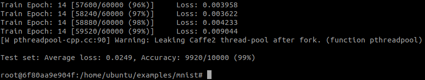

ToDo: Add Table of Contents

# GPU Compute
This repository will serve as a collection of notes and tools for GPU computation, with an initial emphasis on AMD GPUs (Polaris gfx8xx) and their platforms (e.g. ROCm). Over time, information about Nvidia GPUs will also be added.

## 1. Hardware  
The field of GPU computation has been experiencing significant advancements in recent years, driven by the increasing demand for high-performance computing solutions. At the forefront of this progress are two leading companies in the GPU market, Nvidia and AMD. Nvidia GPUs are known for their powerful performance and robust software ecosystem, while AMD GPUs offer a compelling combination of affordability and performance. Whether you are a seasoned veteran or just starting out, this guide will provide you with the information you might find useful to make informed decisions about the hardware you use for your computational needs.

### 1.1 AMD-based GPUs  
AMD-based GPUs are a powerful and flexible choice for GPU computing, offering high performance, scalability, and a rich ecosystem of tools and libraries. However, it's important for developers to be mindful of the challenges and limitations that may arise when using these GPUs, and to choose the best platform and tools to suit their specific needs.

### 1.2 NVidia-based GPUs
Nvidia-based GPUs offer a powerful and flexible platform for high-performance computing and graphics rendering, making them an excellent choice for a wide range of applications. Whether you are working in scientific simulations, machine learning, or multimedia content creation, Nvidia-based GPUs can help you get the most out of your computing resources.

## 2. Software
One of the major challenges in the software arena is the incompatibility between different versions of platforms, drivers, and libraries. This results in significant changes in existing architecture (programs built using these libraries) when transitioning to a new version of the platform (such as ROCm or CUDA). ROCm, for instance, has comparatively limited support and appears more unstable than the CUDA structure of NVIDIA. For example, AMD GPU support is shorter compared to the support provided by NVIDIA. However, there could be various reasons for this, such as a shortage of personnel to handle the programming workload or frequent drastic changes in products (such as gfx8xx, gfx9xx, gfx10xx, RDNA, etc.).

### 2.1 ROCm

#### 2.1.1 Installation Process
##### 2.1.1.1 Docker Images
The current process of installing Docker is relatively straightforward and offers flexibility in overcoming compatibility issues between platforms, drivers, and libraries. Simply install the desired version of the target platform, driver, and libraries. Then use whichever docker image is appropriate for the purpose without changing much in the host system. An evaluation is necessary to see the difference between Docker installations as well. 

- [Frameworks Installation](https://docs.amd.com/bundle/ROCm-Deep-Learning-Guide-v5.3/page/Frameworks_Installation.html)

##### 2.1.1.2 Standard Installation
AMD has undergone changes to its documentation system without properly maintaining the previous libraries. For instance, ROCm documentation with some links can be found at [GitHub](https://github.com/RadeonOpenCompute/ROCm/), while another one [here](https://rocmdocs.amd.com/), at yet another [here](https://docs.amd.com/). This repetition in the documentation creates confusion and wastes time for users. To remain competitive in the market, AMD needs to take concrete steps to streamline its documentation and support. For example, irrespective of the reference or option, we have encountered a problem with ROCm 3.7 installations, which experience computational issues with gfx803-based GPUs (such as the RX580). Unfortunately, AMDs solution is cutting the support of this particular product. Fortunately, there are various comments and potential solutions available online related to this and similar issues (gfx900 or gfx1000 series).  

Here, we need to refer some of the good examples of fixing the issues for installation:
- [xuhuisheng/rocm-build](https://github.com/xuhuisheng/rocm-build) and [xuhuisheng/rocm-gfx803](https://github.com/xuhuisheng/rocm-gfx803)  
- rictorp/rocm.md ([gist link](https://gist.github.com/rigtorp/d9483af100fb77cee57e4c9fa3c74245))  
- [AIeater](https://github.com/aieater/rocm_pytorch_informations) by [GPUeater](https://www.gpueater.com/index.html)

A reference of the GPU comparisons from GPUeater's webpage (relatively old data),


### 2.2 CUDA
The same issues arises that AMD ROCM system has with CUDA. Updates and changes of the dependencies, libraries, and hardware make it difficult to develop solutions by using GPU computation for deep learning applications. Therefore, in enterprise level there are solutions such as using cloud platforms, kubernetes, and other devop solutions. For researchers or deep learning studies, it becomes a problem to develop solutions due to lack of support. Therefore, for AMD's ROCM case we utilize Docker containers to ease this preparations. However, preparing right structure in a framework would ease the step of compatibility for the general user. With that, we added here a specific open-source framework, [Cresset](https://github.com/cresset-template/cresset), that could be useful CUDA based machine learning efforts while still using familiar Docker as a platform. 

## 3. Test Systems
### 3.1 Hardware
**a) ROCM/AMD**  
**CPU:** [AMD Ryzen ThreadRipper Pro 3955X (16 Cores - 32 VCPUs)](https://www.amd.com/en/products/cpu/amd-ryzen-threadripper-pro-3955wx)  
**GPUs:**  
  6x AMD Radeon RX580 (8 Gb each)  
  2x AMD Inception MI25 (16Gb each)   
**RAM:** 256 Gb DDR4 3200Mhz  
**Motherboard:** [Asus WX WRX80E-SAGE](https://dlcdnets.asus.com/pub/ASUS/mb/SocketTRX4/Pro_WS_WRX80E-SAGE_SE_WIFI/E19401_Pro_WS_WRX80E-SAGE_SE_WIFI_UM_V2_WEB.pdf)  

__Note:__ The BIOS (current up-to-date version 1003) of Asus WX WRX80E-SAGE board was problematic during the first run with multiple GPUs. It requires to downgrade the BIOS to 0701 with a specific way (e.g., [BIOS Flashback](https://www.youtube.com/watch?v=FPyElZcsW6o)). One also needs to switch off the on-board graphics output switch (by default on). 


**b) Cuda/NVidia**  
- (LambdaClouds)[https://cloud.lambdalabs.com/instances] System (1xA10)  
**CPU:** Intel Xeon Platinum 8358 CPU @ 2.60 GHz  
**GPU:** 1x NVidia A10 (24 GB)  
**RAM:** 200 GiB  
**HDD:** 1.4 TiB  

### 3.2 Software  
Irrespective of the hardware from section 3.1, below are the information for the software that is setup for the benchmark in the next section:  
**OS:** Linux 20.04.5 LTS (focal)  
**Kernel:** 5.15.0.58-generic  
**Python:** 3.8.10  
**Docker:** version 23.0.0, build e92dd87  

### 3.2.1 ROCm  

**3.2.1.1 Benchmarks**  
It is crucial to evaluate the hardware and software using a standardized architecture. The following results showcase the performance of hardware from two widely recognized frameworks, along with some of their benchmark results obtained from their respective Github repositories.

**3.2.1.1.1 Pytorch**  
**a - Single GPU**  
[Pytorch/examples repository](https://github.com/pytorch/examples) is one of the great references to see the performance of the current hardware and software.  

__MNIST__  
```
$ git clone https://github.com/pytorch/examples
$ cd examples/mnist
$ python3 main.py --no-mps
```  
MNIST Result (gfx803 - ROCm 4.3 - torch 1.9.0a0+gitd69c22d)


**b - Multi GPU**  
References:  
- [Getting Started with Distributed Data Parallel](https://pytorch.org/tutorials/intermediate/ddp_tutorial.html)
- [SINGLE-MACHINE MODEL PARALLEL BEST PRACTICES](https://pytorch.org/tutorials/intermediate/model_parallel_tutorial.html)
- [PCIe X16 vs X8 with 4 x Titan V GPUs for Machine Learning](https://www.pugetsystems.com/labs/hpc/PCIe-X16-vs-X8-with-4-x-Titan-V-GPUs-for-Machine-Learning-1167/)

**3.2.1.1.2 Tensorflow**  
A good reference for performance comparison can be found [here](https://github.com/ROCmSoftwarePlatform/tensorflow-upstream/issues/173).  

**References**  
Yin, Junqi, et al. "Comparative evaluation of deep learning workloads for leadership-class systems." BenchCouncil Transactions on Benchmarks, Standards and Evaluations 1.1 (2021): 100005.
